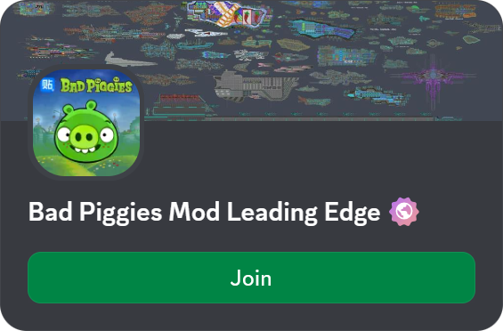
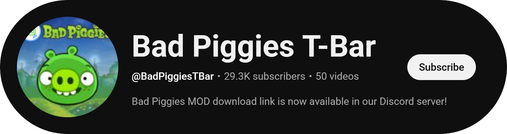

# BPLE Decompilation

This repository contains a decompiled source code of BPLE by Miuna.

## Credits

- [Miuna](https://github.com/miu-na) for all the prior modding effort on Bad Piggies.
- [AssetRipper](https://github.com/AssetRipper/AssetRipper) for Unity project decompilation.
- [ChatGPT](https://chatgpt.com) for manual shader reverse engineering.
- [Rovio](https://www.rovio.com) for creating the base game Bad Piggies.

## How To Build

- Install [Unity 2021.3.45f2](https://unity.com/releases/editor/whats-new/2021.3.45f2)
- Clone this repository `git clone --depth=1 https://github.com/anstropleuton/BPLE.git`
- Open the project from Unity
- Enjoy :)))

## Open Source?

This is NOT "open source" in any traditional sense. No authors involved has granted rights to copy, modify or distribute. Use at your own risk.

## Legal Notice

This project is NOT affiliated with Rovio in any way. This decompilation and BPLE exists to extend the base game Bad Piggies and to keep it alive. We are releasing the decompilation source code of BPLE publicly in hopes of keeping the Bad Piggies community alive.

Please, feel free to fork this project and make your own modifications on top of it!

## Socials

Let us know what you did with the decompilation in our Discord server!

Subscribe to our YouTube channel for great BPLE videos!

